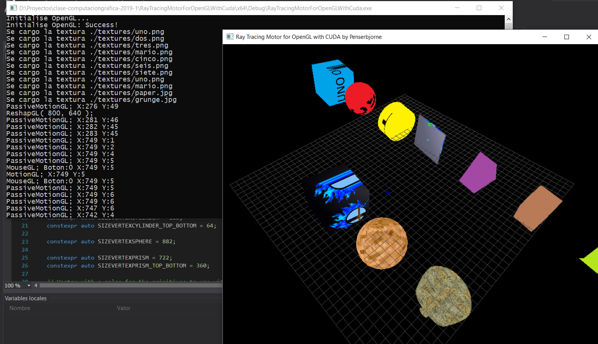
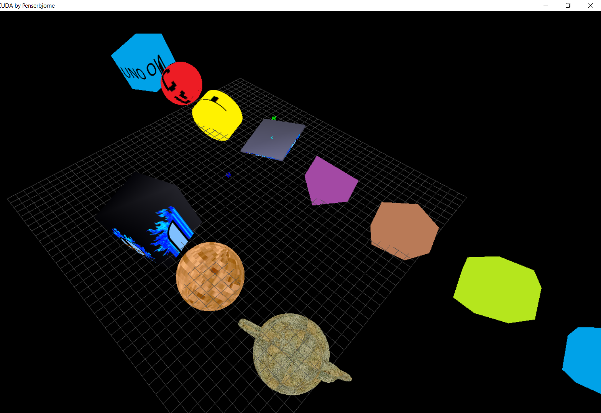
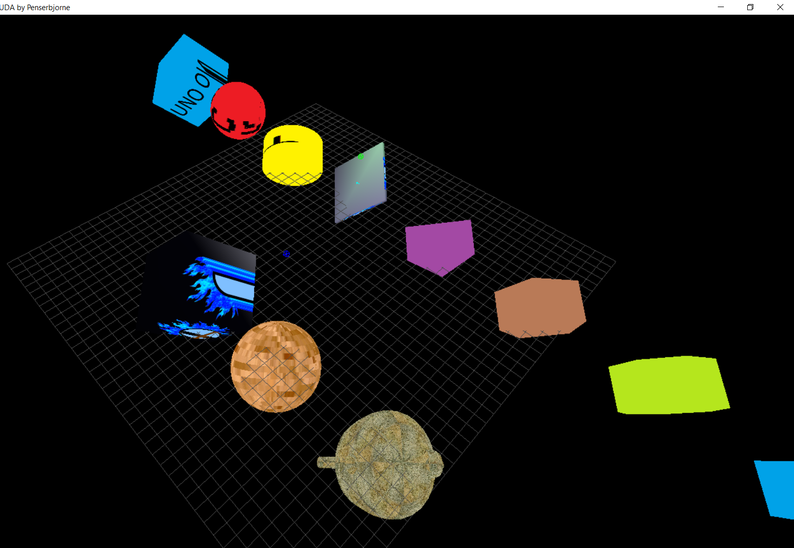
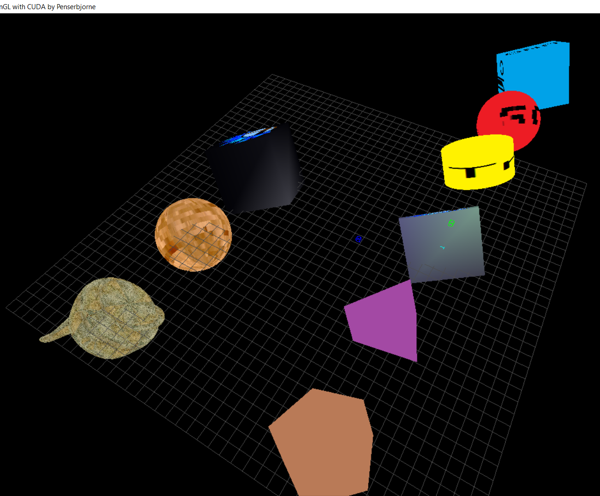
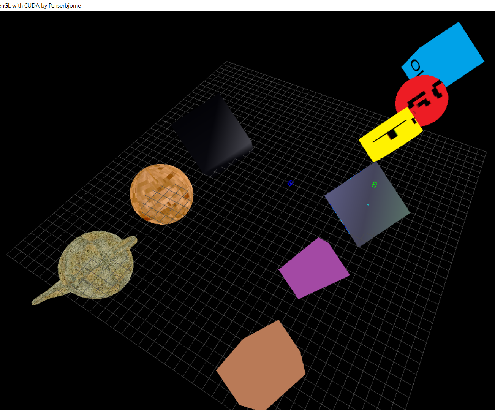
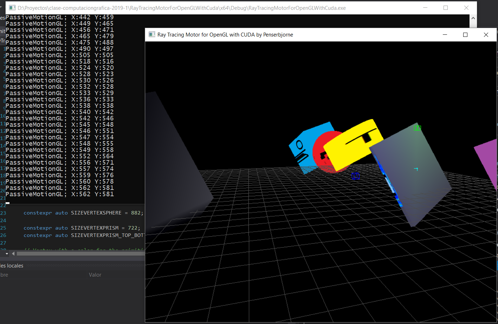
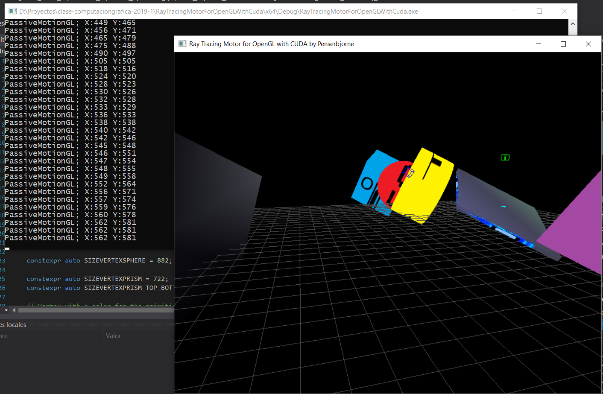
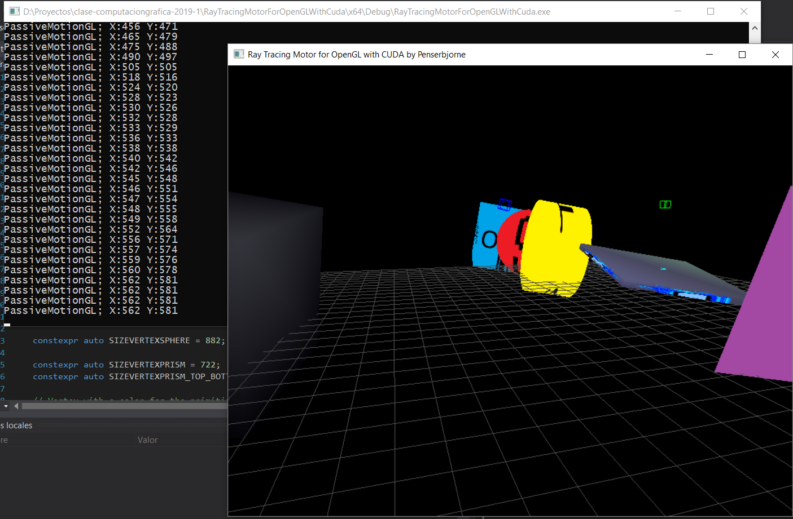

# Clase de Computación Gráfica 2019-1
Proyecto final para la clase de Computación Gráfica, FI, UNAM, 2019-1

[Repositorio del proyecto: https://github.com/penserbjorne/clase-computaciongrafica-2019-1](https://github.com/penserbjorne/clase-computaciongrafica-2019-1)

[Aquí el enlace a YouTube: https://youtu.be/y9eq8vUzcj0](https://youtu.be/y9eq8vUzcj0) de la ejecución del proyecto.

## Objetivo y requerimientos del proyecto

**Objetivo:** Crear un renderizador de una escena aplicando técnicas de graficación de ray-tracing.

**Elementos a implementar**

- [ ] (5%) Leer de un archivo la configuración de su mundo, el formato que se debe manejar son archivos YAML (Obligatorio).
- [ ] Se podrá configurar los siguientes elementos.
  - [x] (10%) Luces: Se pondrá configurar los diferentes tipos de luces.
    - [x] Spot
    - [x] Point
  - [ ] (10%) Modelos: Los modelos geométricos que se debe implementar son:
    - [x] Cubos
    - [x] Cilindros
    - [x] Esferas
    - [x] Prismas
    - [ ] Modelos en formato OBJ
    - [x] Planos
  - [x] (10%) Se podrá colocar una textura a cada modelo, si el objeto es reflectivo o refractivo.
  - [ ] (10%) Múltiples cámaras.
    - [x] Manejar la cámara en primera persona y la cámara orbital (Arcball).
      - [x] Para ambas cámaras los movimientos de pitch y yaw realizarlos con el mouse.
    - [ ] Al seleccionar un objeto en específico de la escena crear una nueva cámara Orbital que permite visualizar al objeto desde todos los ángulos.
    - [ ] Se podrá cambiar las múltiples cámaras con combinaciones de teclas.
 - [ ] (10%) Configuración del orden del ray-tracing.
 - [ ] (10%) Para los objetos sólidos manejar sombras.
 - [ ] (35%) Optimizar el ray tracing con CUDA:
   - [ ] Ray-Tracing en paralelo, el reto está en la recursividad y concurrencia de los núcleos de CUDA.
   - [ ] Realizar una partición del mundo en Octrees utilizando CUDA.

Los elementos marcados como completados son los que se encuentran en esta parte del proyecto, otros elementos que corresponden al Ray Tracing se encuentran en la sección del camarada [Emilio Cabrera](https://github.com/emilio1625/raytracing).

## Descripción de la implementación

### Configración

En [este repositorio](https://github.com/penserbjorne/clase-computaciongrafica-2019-1) se encuentra el código realizado por Paul Aguilar.

El código se realizo en Visual Studio 2017, utilizando las siguientes bibliotecas:

- OpenGL
- GLUT
- GLEW
- GLM
- SOIL
- Cuda 10

El proyecto de VS se encuentra configurado para las herramientas ya mencionadas. Por lo cual para ejecutarlo basta con abrir la solución en VS2017 y ejecutarla.

Como documento de entrada se pretendía Utilizar un archivo basado en el [example-world.yaml](./example-world.yaml) que se encuentra en este mismo repositorio.

### Descripción

En el proyecto se encuentran los archivos:

- **main.cpp** : Archivo con la función main del proyecto, así como las funciones que requieren OpenGL y GLUT para el manejo de eventos de entrada y salida como son ventana, mouse y teclado.
- **myCameraFPS.h** y **myCameraFPS.cpp** : Clase enfocada al menejo de cámara en primera persona.
- **myPrimitives.h** y **myPrimitives.cpp**: Archivos que contienen las clases que gestionan las primitivas y objetos del proyecto, entre estos se encuentran:
  - Luces
  - Materiales
  - Cubos
  - Cilindros
  - Esferas
  - Prismas
  - Planos

Los objetos se dibujan directamente desde el Vertex Buffer Object (VBO), teniendo capacidad para manejar:
- Posición del vértice
- Colores
- Vectores normales del vértice
- Coordenadas UV

A su vez las primitivas cuentan con funciones para cargar texturas:

- **loadTexture** : Recibe como parámetro la ubicación de la textura.
- **bindTexture** : Asocia y aplica la textura al modelo.
- **unbindTexture** : Desasocia la textura del modelo.

Las texturas se cargan con el cargador de la biblioteca SOIL.

Para los materiales se utiliza el método **apply** el cual aplica sobre el objeto que se va a dibujar el material.

Para las luces se utilizan los métodos:

- **activate** : El cual _enciende_ la luz.
- **deactivate**: El cual _apaga_ la luz.

Tanto para luces como para materiales se utilizan las componentes ambiental, difusa y especular. En el caso de materiales se añade la componente de emisión, y en las luces se añaden los elementos de atenuación y los requeridos para el tipo de luz (spot y point).

### USO

Los movimientos de cámara se realizan con el mouse, respetando las cámara en primera persona al presionarse el botón izquierdo del mouse.

Los movimientos de desplazamiento se pueden realizar con las teclas a, s, d, w  y con las teclas de flecha del teclado.

[Aquí el enlace a YouTube: https://youtu.be/y9eq8vUzcj0](https://youtu.be/y9eq8vUzcj0) de la ejecución del proyecto.

### Pendientes a implementar (ToDo's)

- Utilización de Shaders para procesamiento.
- Gestor dinámico de línea de comandos para creación de objetos en la escena fuera del código.
- Comunicación del buffer de OpenGL con CUDA para el ray tracing.

## Observaciones y conclusiones

La implementación de un Ray Tracing es bastante divertida y obliga a combinar herramientas bastante interesantes, en este caso, la forma en como se abordo el problema considero que no fue adecuada ya que los módulos que se realizaron no se pudieron interconectar, sin embargo con un buen pipeline definido para el proyecto el resultado pudo haber sido diferente, en ese sentido creo que la utilización de shaders combinados con el uso de CUDA u OpenCL hubiera sido una buena dirección para el proyecto.

En lo personal me gustaría ampliar este proyecto con el camino adecuado.

## Recursos consultados
- [Repositorio de Computación Gráfica del profesor Ricardo Martell](https://github.com/rmartella/ComputacionGrafica)
- [Introduction to OpenGL for Game Programmers by Jeremiah van Oosten.](https://www.3dgep.com/introduction-opengl/)
- [Texturing and Lighting in OpenGL by Jeremiah van Oosten.](https://www.3dgep.com/texturing-and-lighting-in-opengl/)
- [Using OpenGL Vertex Buffer Objects by Jeremiah van Oosten.](https://www.3dgep.com/using-opengl-vertex-buffer-objects/)
- [OpenGL Vertex Buffer Object (VBO) by Song Ho Ahn](https://www.songho.ca/opengl/gl_vbo.html)

## Recursos para consultar

### GLSL y otras cosas ;@

- [Introduction to OpenGL and GLSL by Jeremiah van Oosten.](https://www.3dgep.com/introduction-to-opengl-and-glsl/)
- [Texturing and Lighting with OpenGL and GLSL by Jeremiah van Oosten.](https://www.3dgep.com/texturing-and-lighting-with-opengl-and-glsl/)
- [Forward vs Deferred vs Forward+ Rendering with DirectX 11 by Jeremiah van Oosten.](https://www.3dgep.com/forward-plus/)

### CUDA

- [Introduction to CUDA using Visual Studio 2008 by Jeremiah van Oosten.](https://www.3dgep.com/introduction-to-cuda-using-visual-studio-2008/)
- [An Even Easier Introduction to CUDA](https://devblogs.nvidia.com/even-easier-introduction-cuda/)
- [CUDA Thread Execution Model by Jeremiah van Oosten.](https://www.3dgep.com/cuda-thread-execution-model/)
- [CUDA Memory Model by Jeremiah van Oosten.](https://www.3dgep.com/cuda-memory-model/)
- [Introduction to CUDA 5.0 by Jeremiah van Oosten.](https://www.3dgep.com/introduction-to-cuda-5-0/)
- [OpenGL Interoperability with CUDA by Jeremiah van Oosten.](https://www.3dgep.com/opengl-interoperability-with-cuda/)
- [Optimizing CUDA Applications by Jeremiah van Oosten.](https://www.3dgep.com/optimizing-cuda-applications/)

### Ray Tracing

- [Ray Tracing in One Weekend by Peter Shirley.](https://github.com/petershirley/raytracinginoneweekend)
- [Ray Tracing The Next Week by Peter Shirley.](https://github.com/petershirley/raytracingthenextweek)
- [Ray Tracing The Rest of Your Life by Peter Shirley.](https://github.com/petershirley/raytracingtherestofyourlife)
- [Accelerated Ray Tracing in One Weekend in CUDA](https://devblogs.nvidia.com/accelerated-ray-tracing-cuda/)
